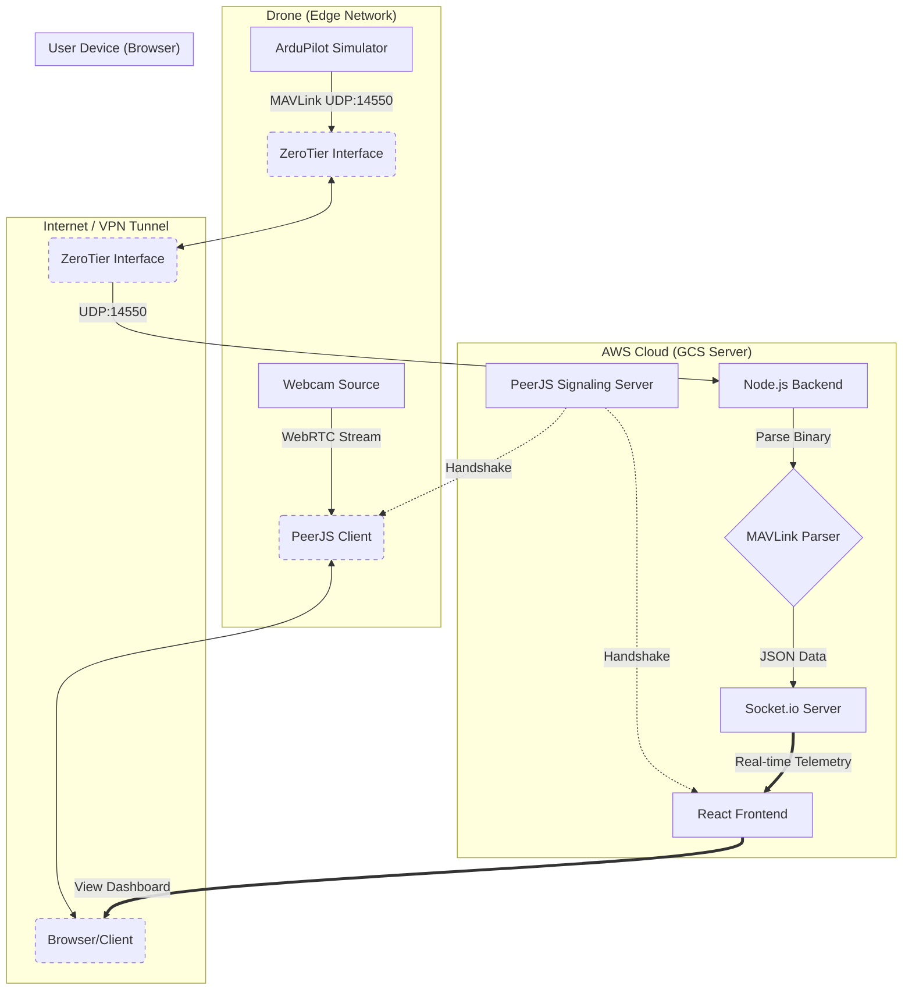

# VyomGarud GCS 


**VyomGarud GCS** is a professional Ground Control Station (GCS) designed for monitoring and controlling UAVs. It features real-time telemetry visualization, low-latency video streaming via WebRTC, and an interactive map interface. Built for high performance and reliability during autonomous missions.

## 🌟 Features

- **Real-time Telemetry**: Live monitoring of Attitude (Roll, Pitch, Yaw), GPS Position, Battery Status, and Flight Modes.
- **Low-Latency Video**: Integrated WebRTC video feed using PeerJS for real-time situational awareness.
- **Interactive Map**: Leaflet-based map visualization tracking the drone's path and home position.
- **Mission Logging**: Automated logging of system status messages and flight events.
- **Responsive Design**: Modern, dark-themed UI built with Tailwind CSS for optimal visibility in field conditions.

## 🏗️ Architecture



## 🚀 Getting Started

### Prerequisites
- Node.js (v16 or higher)
- npm or yarn
- A MAVLink-compatible drone or simulator (e.g., ArduPilot SITL)

### Installation

1.  **Clone the Repository**
    ```bash
    git clone https://github.com/yourusername/vyom-gcs.git
    cd vyom-gcs
    ```

2.  **Setup Backend**
    ```bash
    cd backend
    npm install
    # Start the server (Listens on UDP 14550 for MAVLink)
    node server.js
    ```

3.  **Setup Frontend**
    ```bash
    cd ../frontend
    npm install
    # Start the development server
    npm run dev
    ```

4.  **Access the GCS**
    Open your browser and navigate to `http://localhost:5173` (or the IP provided by Vite).

## 📡 Telemetry Connection

The backend listens for MAVLink packets on **UDP Port 14550**.
- **Simulation**: Configure your SITL to output to the backend IP.
- **Real Hardware**: Use MAVProxy or a telemetry radio to forward packets to the backend's IP/Port.

## 🎥 Video Streaming

The video feed uses **PeerJS**.
1.  Open `public/drone.html` on the device connected to the camera (or in a separate browser tab for testing).
2.  Click "Start Camera" to begin streaming.
3.  The GCS Frontend will automatically connect to the stream ID `drone-sender`.

## 🛠️ Tech Stack

- **Frontend**: React, Vite, Tailwind CSS, Leaflet, PeerJS
- **Backend**: Node.js, Express, Socket.io, node-mavlink
- **Communication**: UDP (MAVLink), WebSockets (Telemetry), WebRTC (Video)

---
*Developed for Senior Internship Project*
